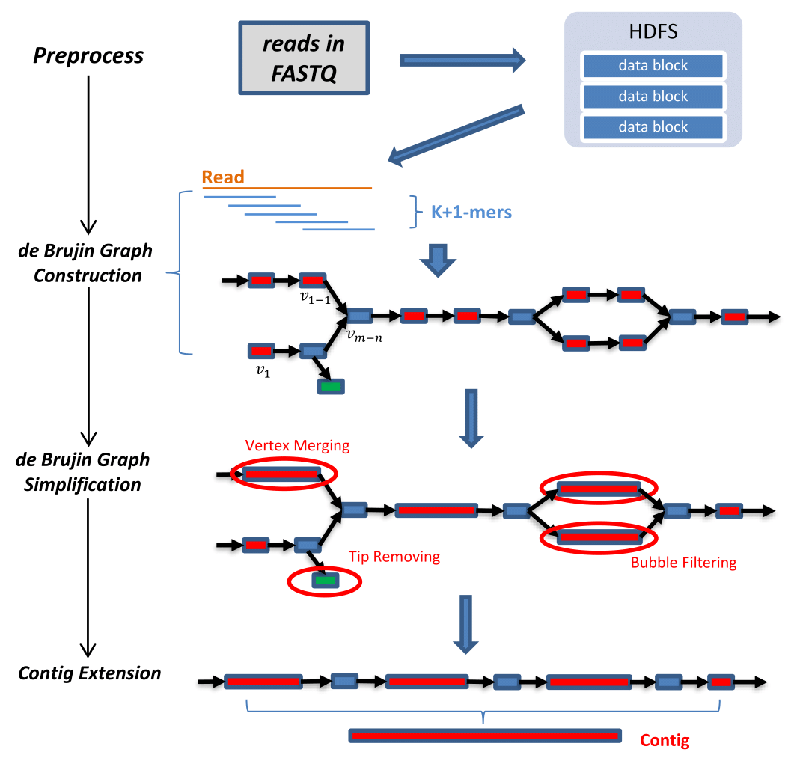
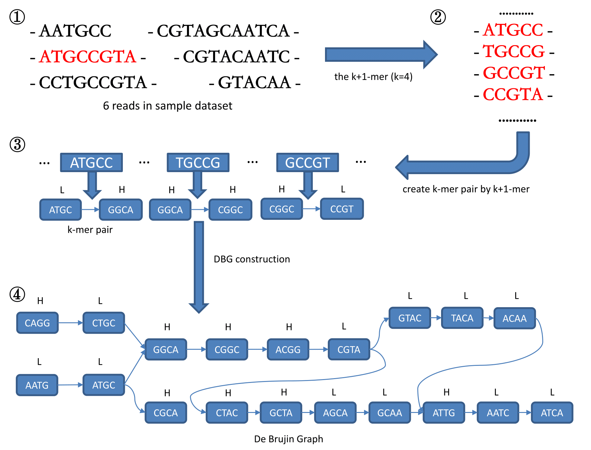
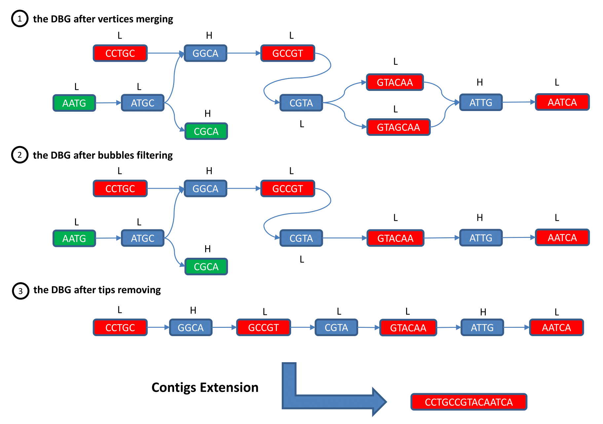

# Tutorials

The approach of de novo genome assembly in PPA-assembler can be presented by the following figure. The short DNA sequences (i.e., reads) are parsed from the FASTQ format files on HDFS. The **k+1 mers** are created from those reads accordingly, and then to construct the de Brujin Graph where each k-mer is a vertex in the graph. Hence, the DNA sequencing problem has been converted into a graph simplification problem, to delete those redundant paths (i.e., tips and bubbles).



We also provide one complete example as below to further demonstrate the specific procedure:

**De Brujin Graph Construction**  


**Graph Simplification & Contig Extension**


PPA-assembler is a toolkit to provide a set of efficient operations under distributed setting for DBG construction and contig generation using Pregel. The performance of each operation is naturally guaranteed by our previous work [**Practical Pregel Algorithms**].

PLEASE follow the instruction in ```${PPA_ROOT}/PPA-Assembler-conf.ini``` to learn how to configure each parameter for PPA-assembler.